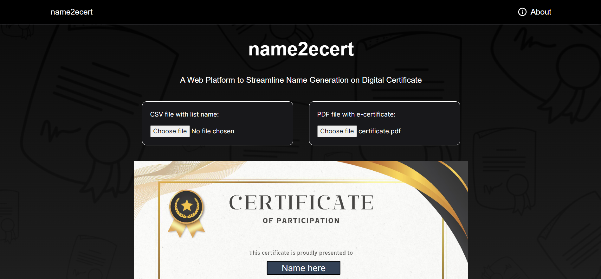

## About name2ecert

A web platform to generate participant's name on e-certificate. The purpose of the application is to ease and save the time especially for event organizers that need to make certificate for the participants that joined their event. 



## Usage

This application will need 2 file inputs. The list name of participants need to be in CSV file file format. The list name should only have 1 column with a header called "name". All participant name must be under the "name" column. Users should already have their designated e-certficate that need to be uploaded in PDF file format.

Example CSV file with list name of participant as below:

name                  | -> "name" is spelled in lowercase
--------------------- | -------------
participant name      | -> Content cell with names
participant name      | -> Content cell with names
participant name      | -> Content cell with names
the list goes on...   |

Users can position the anchor to the prefered location for the participant's name on the certificate. The platform provides three text customization options, allowing users to adjust font size, select from several font types, and choose a font color. Additionally, users can preview the edited file before downloading all the certificates together.

## Accuracy

The accuracy of the generated name's position may vary depending on the device screen size and document dimensions. It is advisable to use the application on a screen with a 16:9 aspect ratio, and the PDF document should be formatted to A4 size, whether in landscape or portrait orientation. 

## Getting Started for Development

First, run the development server:

```bash
npm run dev
# or
yarn dev
# or
pnpm dev
# or
bun dev
```

Open [http://localhost:3000](http://localhost:3000) with your browser to see the result.

